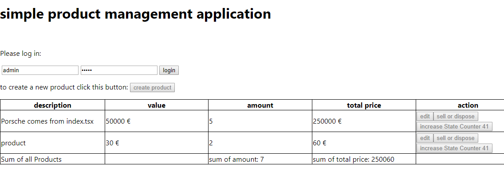

## Typescript and Redux Framework
This is an example app to show how to build a scalabe single page progressive web app with typescript, redux and react.
React is as loosly coupled as possible to the concept, and could be easily replaced by native WebComponents.
https://developer.mozilla.org/de/docs/Web/Web_Components
## preparation:
cd m3-redux-statemanagement
npm install
## Iteration 1
* First look at the Index.tsx and App.tsx files.
​
A lot of things have changed because we want to manage our states with redux.
    Take your time to understand the adaptations. You can also have a look at our framework we build for this lab. We provided
    in the folders framework, reducer and state a lot of functions you can use for your application. Those functions are part of a
    framework we created. Don't worry, you don't need to comprehend every detail of this framework.
    You just need to know that we provide "get" functions for all states and that all reducer functions are defined in our appReducer file.
​
​
​
* After you got an overview of the code and framework, change all variable and object names from asset to product.
​
This change doesn't only make sense because we want to build a shopping card. It will force you to look more precise to the code before starting to extending  it.
    You will see, that you will need to change every important file and typescript will tell you still need to change.
​
#### all changes summed up:
- change the headline to: simple product management application
​
- adapt filename & import path for the child component   
    src/components/SimpleAsset.tsx => SimpleProduct.tsx
​
- rename the class name in SimpleProduct.tsx to SimpleProduct
​
- within the App.tsx adapt component name  in import def & component call    
    SimpleAsset => SimpleProduct
​
- Use the Replace in Files function of VSCode to replace...
    IAssetData =>  IProduct   
    asset => product (but make sure, you do not touch the package.json or serviceworker.js)
​
​
* After you finished renaming everything add two new columns. One for the amount per product and another for the total price of the product in regards to its amount.
​
​
​

## Iteration 2
 For the next iteration, we want to add a new component. This component should sum up the amount and total price of all our products.
    This means, if you change something in one product, you should also see a difference in the sum component.
​
#### App.tsx / AppState.ts /index.tsx / appReducer (update_product)
- product_amount: number; 
- product_totalPrice: number;
	
#### At the handleCreateProduct() method for the newProduct;
- product_amount: 1,
- product_totalPrice: 0
​
####  At the app, create new rows, replace the th tags:
    <tr>  
        <th>description</th>
        <th>value</th>
	    <th>amount</th>
	    <th>total Price</th>
	    <th>action</th>
    </tr>
​
####  At the SimpleProduct.tsx … add input fields for active edit.mode:
	
	<td><input type="number" name="value" value={window.CS.getBMState().products[0].product_amount}
	onChange={this.handleAmountChange} /></td>
	
	<td>{window.CS.getBMState().products[0].product_totalPrice} €</td>
	 
#### for inactive edit.mode:
	
	`<td>{window.CS.getBMState().products[0].product_amount}</td>`
	<td>{window.CS.getBMState().products[0].product_totalPrice} €</td>  
​
​
## Iteration 3
​
* In our component folder create a SimpleSum.tsx . Hint: Don't create a new action. For this iteration, it's enough
to extend the existing actions.
​
* Don't forget to add and use new states (totalPrice and amount for example) in our appState file. We want to use Redux so that we don't need to use a state lift up.
​
You should be able to get all states in our appState file with following get functions:
​
* window.CS.getBMState()
* window.CS.getUIState()
​

​
## Iteration 4
Now we want to implement a fake log in and log out function. This login/logout function should just disable all buttons on our page. If you look at our User Interface states (interface IUI at appState.ts) you will see that we already defined a state for our login.
We want to use and work with this state on a new component.
​
* Add in our components folder the new component and name it SimpleLogin. Call it from below the headline of the app.
​
* Our SimpleLogin will need new reducer cases in our appReducer file.
​
* We want to create a new action for Login and one for logout. 
​
* For the validation you can simply add a User object with the properties "username" and "password" in our Business Model (IBM at appState.ts). We need to do this because in this exercise we don't use any Database.
​
​
